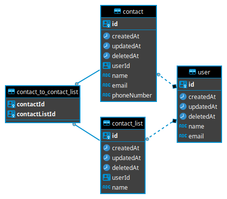

## Prerequisite

- [Node](https://nodejs.org/en/download/) (preferrably v14.16.1)
- [docker](https://docs.docker.com/engine/install/)
- [yarn](https://classic.yarnpkg.com/lang/en/docs/install)

## Installation

```bash
$ yarn install
```

## Running the app

```bash
# development
$ yarn run start

# watch mode (Automatic compile)
$ yarn run start:dev

# production mode
$ yarn run start:prod
```

## Test

```bash
# unit tests
$ yarn run test

# unit tests using automatic recompile
$ yarn run test:watch

# e2e tests
$ yarn run test:e2e

# test coverage
$ yarn run test:cov
```

## Swagger Documentation

Open [http://localhost:4000/api/](http://localhost:4000/api/) after running the app.

## Entity Relationship Diagram


## Connecting to DB

To connect to local DB from your machine:
- The credential is located at .env.example.
- While the port is 5433 (specified in [docker-compose](../docker/dev/docker-compose.yml))
